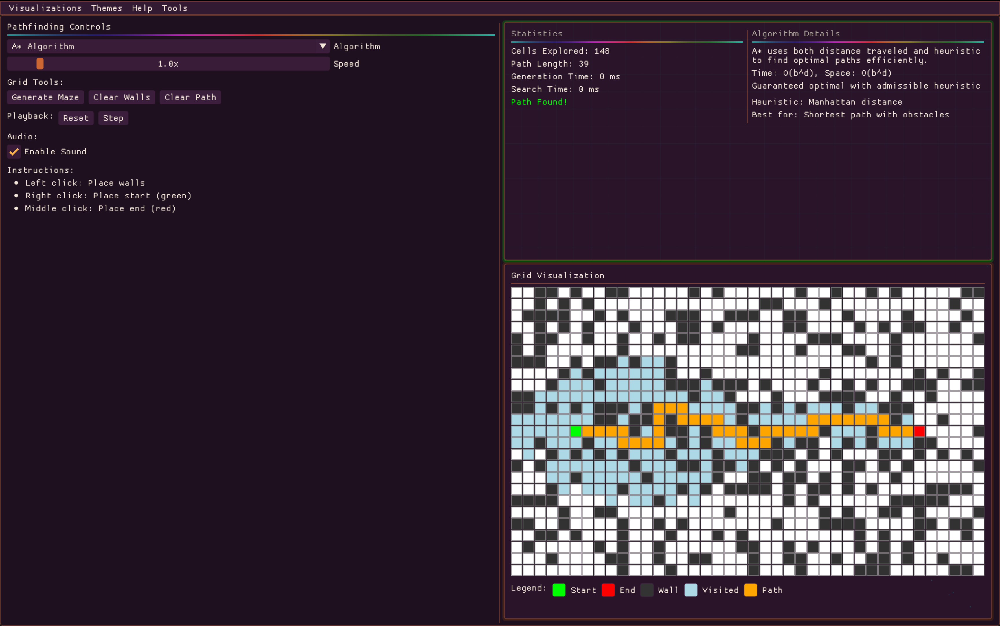
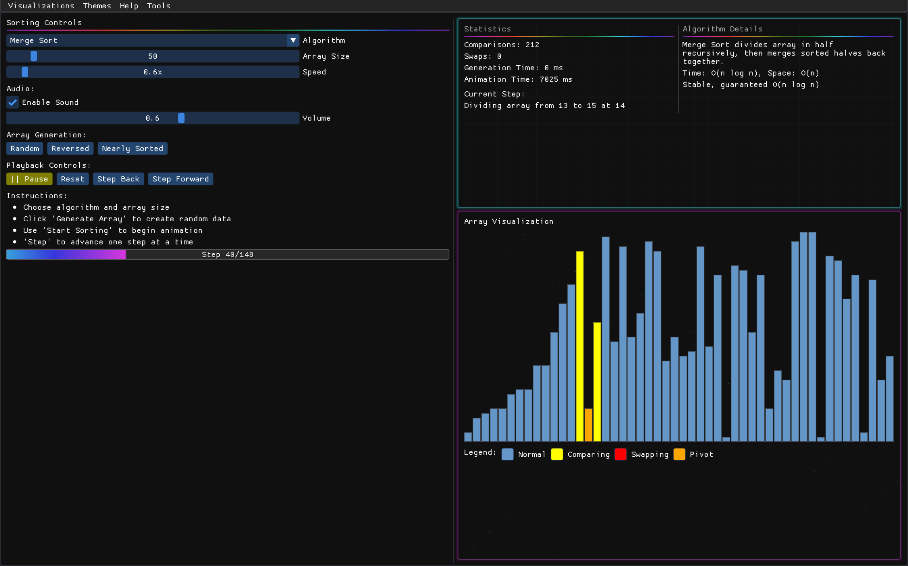

# Algo1 - Algorithm Visualizer

> **A stunning algorithm visualization platform built with Modern C++20**

*Developed by Garrett Flowers & Seth Deloney • Educational Tool • 2025*

---

## Table of Contents

- [Overview](#overview)
- [Quick Start](#quick-start)
  - [Prerequisites](#prerequisites)
  - [Installation](#installation)
  - [Troubleshooting](#troubleshooting)
- [Algorithm Library](#algorithm-library)
  - [Sorting Algorithms](#sorting-algorithms)
  - [Search Algorithms](#search-algorithms)
  - [Pathfinding Algorithms](#pathfinding-algorithms)
  - [Graph Algorithms](#graph-algorithms)
  - [Tree Algorithms](#tree-algorithms)
- [Themes & Customization](#themes--customization)
- [Performance Analysis](#performance-analysis)
- [Project Architecture](#project-architecture)
- [Technology Stack](#technology-stack)
- [Educational Use](#educational-use)
- [Advanced Features](#advanced-features)
- [Build Configurations](#build-configurations)
- [Performance Benchmarks](#performance-benchmarks)
- [Contributing](#contributing)
- [License & Attribution](#license--attribution)
- [Screenshots](#screenshots)
- [Showcase](#showcase)

---

## Overview

**Algo1** is a comprehensive, interactive algorithm visualization application that brings computer science concepts to life through beautiful real-time animations, retro aesthetics, and immersive audio feedback. Built with cutting-edge C++20 features and modern GUI technologies.

### Key Features

- **5 Algorithm Categories** - Sorting, Search, Pathfinding, Graph, and Tree algorithms
- **6 Beautiful Themes** - Dark, Light, Cyberpunk, Ocean, Forest, and Sunset
- **Retro UI Effects** - Animated progress bars, glowing buttons, scanlines, and neon borders
- **Audio Feedback** - Immersive sound effects synchronized with algorithm steps
- **Performance Analysis** - Real-time metrics, benchmarking, and export capabilities
- **Retro Splash Screen** - Cyberpunk-styled loading experience
- **Step-by-Step Visualization** - Interactive controls with play, pause, and manual stepping
- **Data Export** - Export results in CSV, JSON, or XML formats
- **Educational Focus** - Detailed algorithm information and complexity analysis


*A* pathfinding algorithm with retro neon styling, animated effects, and comprehensive algorithm analysis*

---

## Quick Start

### Prerequisites

- **C++20 Compiler**: GCC 10+, Clang 12+, or MSVC 2019+
- **CMake**: 3.20 or higher
- **vcpkg**: Microsoft's C++ package manager

### Installation

#### Option 1: Using vcpkg (Recommended)

1. **Install and setup vcpkg**:
```bash
git clone https://github.com/Microsoft/vcpkg.git
cd vcpkg
./bootstrap-vcpkg.sh  # On Windows: .\bootstrap-vcpkg.bat
export VCPKG_ROOT=$(pwd)

# Make VCPKG_ROOT persistent (choose your shell):
# For Bash: echo "export VCPKG_ROOT=$(pwd)" >> ~/.bashrc
# For Zsh: echo "export VCPKG_ROOT=$(pwd)" >> ~/.zshrc
# For Fish: echo "set -gx VCPKG_ROOT $(pwd)" >> ~/.config/fish/config.fish
```

2. **Clone and build the project**:
```bash
git clone https://github.com/Garrett12123/algo1.git
cd algo1

# Configure with vcpkg
cmake --preset=default

# Build
cmake --build --preset=default

# Run
./build/default/algo1
```

#### Quick Start (if vcpkg is already installed)

If you already have vcpkg installed and `VCPKG_ROOT` set:

```bash
git clone https://github.com/Garrett12123/algo1.git
cd algo1
cmake --preset=default && cmake --build --preset=default
./build/default/algo1
```

#### Option 2: Manual dependency installation

If you prefer installing dependencies manually:

**macOS with Homebrew**:
```bash
brew install cmake ninja fmt glfw imgui openal-soft
git clone https://github.com/Garrett12123/algo1.git
cd algo1
cmake -B build -DCMAKE_BUILD_TYPE=Release
cmake --build build
./build/algo1
```

**Ubuntu/Debian**:
```bash
sudo apt update
sudo apt install cmake ninja-build libfmt-dev libglfw3-dev libopenal-dev
# Note: You may need to install ImGui and ImPlot manually
git clone https://github.com/Garrett12123/algo1.git
cd algo1
cmake -B build -DCMAKE_BUILD_TYPE=Release
cmake --build build
./build/algo1
```

**Windows with Visual Studio**:
```bash
# Install vcpkg first, then:
git clone https://github.com/Garrett12123/algo1.git
cd algo1
cmake --preset=default
cmake --build --preset=default
.\build\default\algo1.exe
```

#### Troubleshooting

**Common Issues:**

- **vcpkg toolchain not found**: Make sure `VCPKG_ROOT` environment variable is set and points to your vcpkg installation
- **Ninja not found**: Install ninja via your package manager (`brew install ninja`, `apt install ninja-build`, etc.)
- **Missing dependencies**: If using manual installation, ensure all dependencies are installed and can be found by CMake
- **CMake cache conflicts**: If you get cache errors, run `rm -rf build` and try again

**Dependencies:**
- **Required**: CMake 3.20+, C++20 compiler, fmt, GLFW, OpenGL, OpenAL
- **Bundled with vcpkg**: Dear ImGui, ImPlot (automatically handled when using vcpkg)

---

## Algorithm Library

### Sorting Algorithms
- **Bubble Sort** - O(n²) - Simple comparison-based algorithm
- **Selection Sort** - O(n²) - Finds minimum and places at beginning
- **Insertion Sort** - O(n²) - Builds sorted array incrementally
- **Merge Sort** - O(n log n) - Divide and conquer with guaranteed performance
- **Quick Sort** - O(n log n) avg - Fast partition-based sorting
- **Heap Sort** - O(n log n) - Binary heap-based algorithm
- **Tournament Sort** - O(n log n) - Tournament tree visualization
- **Intro Sort** - O(n log n) - Hybrid quicksort/heapsort
- **Patience Sort** - O(n log n) - Based on patience card game

### Search Algorithms
- **Linear Search** - O(n) - Sequential array traversal
- **Binary Search** - O(log n) - Efficient sorted array search
- **Interpolation Search** - O(log log n) - Position estimation search
- **Exponential Search** - O(log n) - Exponential jumps then binary
- **Jump Search** - O(√n) - Fixed-size jump optimization

### Pathfinding Algorithms
- **A\*** - Optimal pathfinding with heuristic guidance
- **Dijkstra** - Shortest path with guaranteed optimality
- **Breadth-First Search** - Unweighted shortest path exploration
- **Depth-First Search** - Deep exploration pathfinding

### Graph Algorithms
- **Kruskal's MST** - O(E log E) - Minimum spanning tree with union-find
- **Prim's MST** - O(V²) - Greedy minimum spanning tree
- **Topological Sort** - O(V + E) - Linear vertex ordering
- **Strongly Connected Components** - O(V + E) - SCC detection

### Tree Algorithms
- **Binary Search Tree** - Dynamic ordered tree structure
- **AVL Tree** - Self-balancing BST with rotation
- **Red-Black Tree** - Balanced tree with color properties
- **Min/Max Heap** - Complete binary tree with heap property

---

## Themes & Customization

| Theme | Description | Color Palette |
|-------|-------------|---------------|
| **🌙 Dark** | Classic dark mode | Charcoal, white accents |
| **☀️ Light** | Clean light theme | White, dark text |
| **⚡ Cyberpunk** | Retro neon aesthetics | Cyan, magenta, neon green |
| **🌊 Ocean** | Deep blue marine theme | Ocean blues, aqua highlights |
| **🌲 Forest** | Natural green theme | Forest greens, earth tones |
| **🌅 Sunset** | Warm orange/purple | Sunset oranges, deep purples |

---

## Performance Analysis

### Real-time Metrics
- **Execution Time** - Millisecond precision timing
- **Comparison Count** - Algorithm comparison operations
- **Swap Operations** - Data movement tracking
- **Memory Usage** - Dynamic memory consumption
- **Performance Ratings** - Automatic performance classification

### Export Capabilities
- **CSV Format** - Spreadsheet-compatible data
- **JSON Format** - Structured data for analysis
- **XML Format** - Hierarchical data representation
- **Performance History** - Session-based tracking

---

## Project Architecture

```
algo1/
├── 🎮 src/
│   ├── Application.cpp          # Main application controller
│   ├── algorithms/              # Algorithm implementations
│   │   ├── SortingVisualizer.cpp
│   │   ├── SearchVisualizer.cpp
│   │   ├── PathfindingVisualizer.cpp
│   │   ├── GraphVisualizer.cpp
│   │   └── TreeVisualizer.cpp
│   ├── audio/                   # Audio feedback system
│   │   └── AudioManager.cpp
│   ├── renderer/                # Graphics rendering
│   │   └── Renderer.cpp
│   └── utils/                   # Utility classes
│       └── Timer.cpp
├── 📁 include/                  # Header files
├── 🛠️ CMakeLists.txt           # Build configuration
├── 📦 vcpkg.json               # Dependencies
└── 🔧 CMakePresets.json        # Build presets
```

---

## Technology Stack

| Component | Technology | Purpose |
|-----------|------------|---------|
| **Language** | C++20 | Modern C++ features, ranges, concepts |
| **GUI Framework** | Dear ImGui | Immediate mode graphics interface |
| **Graphics** | OpenGL 3.3+ | Hardware-accelerated rendering |
| **Audio** | OpenAL-Soft | 3D positional audio effects |
| **Plotting** | ImPlot | Real-time data visualization |
| **Formatting** | fmt | Modern string formatting |
| **Build System** | CMake 3.20+ | Cross-platform build automation |
| **Dependencies** | vcpkg | Microsoft's package manager |

---

## Educational Use

### Learning Objectives
- **Algorithm Complexity** - Understand Big O notation through visualization
- **Performance Trade-offs** - Compare algorithm efficiency in real-time
- **Data Structures** - Visualize tree, graph, and array operations
- **Step-by-Step Execution** - Follow algorithm logic with manual stepping
- **Comparative Analysis** - Side-by-side algorithm performance

### Teaching Features
- **Algorithm Information** - Detailed complexity and use-case descriptions
- **Visual Feedback** - Color-coded array elements with retro styling
- **Audio Cues** - Sound effects for comparisons, swaps, and completions
- **Performance Metrics** - Real-time data for algorithm analysis
- **Interactive Controls** - Drag sliders for parameter adjustment
- **Export Capabilities** - Generate reports for classroom use

---

## Advanced Features

### Retro UI System
- **Animated Progress Bars** - Color-shifting rainbow effects with glow
- **Glowing Interactive Elements** - Pulsing buttons and borders  
- **Scanline Effects** - CRT-style visual overlays
- **Retro Grids & Particles** - Animated background elements
- **Neon Styling** - Cyberpunk-inspired window themes

### Performance Optimization
- **Memory Management** - Efficient array and data structure handling
- **Graphics Optimization** - 60+ FPS smooth animations
- **Audio Processing** - Low-latency sound feedback

### Customization Options
- **Array Sizes** - From 10 to 500+ elements
- **Animation Speed** - 0.1x to 10x speed control
- **Data Generation** - Random, sorted, reverse-sorted, nearly-sorted
- **Interactive Sliders** - Drag controls for all parameters

---

## Build Configurations

### CMake Presets

```bash
# Development build with debug symbols
cmake --preset=debug
cmake --build --preset=debug

# Optimized release build
cmake --preset=release  
cmake --build --preset=release

# Default configuration (recommended)
cmake --preset=default
cmake --build --preset=default
```

### Platform Support
- ✅ **macOS** - Apple Silicon & Intel
- ✅ **Linux** - Ubuntu 20.04+, Fedora, Arch
- ✅ **Windows** - Windows 10/11, MSVC 2019+

---

## Performance Benchmarks

| Algorithm | Small Arrays (50) | Medium Arrays (500) | Large Arrays (500) |
|-----------|-------------------|---------------------|---------------------|
| Quick Sort | 0.1ms | 2.1ms | 25.3ms |
| Merge Sort | 0.2ms | 3.8ms | 42.1ms |
| Heap Sort | 0.3ms | 4.2ms | 48.7ms |
| Bubble Sort | 1.2ms | 125ms | 1.25s |

*Benchmarks on Apple M1 Pro, Release build - Arrays limited to 500 elements*

---

## Contributing

We welcome contributions! See `CONTRIBUTING.md` for detailed guidelines. Areas for enhancement:
- **New Algorithms** - Additional sorting, search, or graph algorithms
- **Retro UI Effects** - Enhanced visual effects and animations
- **Performance Optimizations** - Speed and memory improvements
- **Educational Content** - More detailed algorithm explanations
- **Platform Support** - Additional OS compatibility

Please follow our contribution guidelines and code style when submitting pull requests.

---

## License & Attribution

### Core Application
- **License**: MIT License
- **Authors**: Garrett Flowers & Seth Deloney
- **Year**: 2025

### Third-Party Libraries
- **Dear ImGui** - MIT License (Omar Cornut)
- **GLFW** - zlib/libpng License
- **OpenAL-Soft** - LGPL v2.1 License
- **fmt** - MIT License (Victor Zverovich)
- **ImPlot** - MIT License (Evan Pezent)

---

## Screenshots

### Sorting Algorithm in Action

*Step-by-step sorting algorithm visualization with retro UI effects, color-coded comparisons, and real-time performance tracking*

### Pathfinding Algorithm Visualization

*A* pathfinding algorithm with interactive grid, retro neon styling, and comprehensive algorithm statistics*

---

## Showcase

*Experience the future of algorithm education with Algo1's retro-cyberpunk aesthetic, animated UI effects, real-time performance analysis, and immersive audio feedback. Whether you're a student learning algorithms or an educator teaching computer science, Algo1 provides an engaging and comprehensive platform for algorithm visualization.*

**Ready to explore algorithms like never before?**

```bash
git clone https://github.com/Garrett12123/algo1.git
cd algo1
cmake --preset=default && cmake --build --preset=default
./build/default/algo1
```

---

*Built with ❤️ and Modern C++20* 
